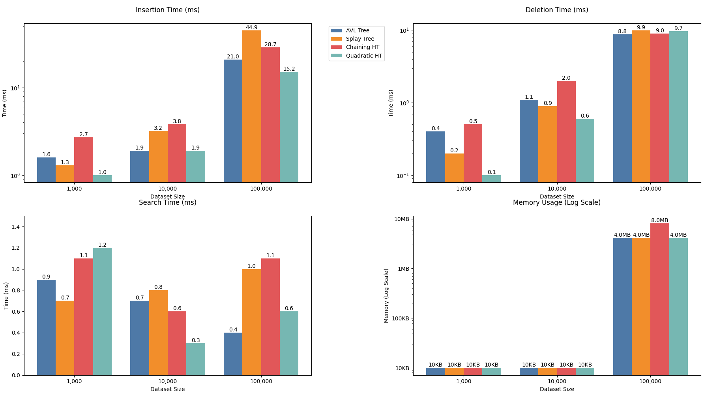

# Assignment 2 Report
Name: `Jonathan Rodriguez`
NetID: `jdr220004`
Section: `501`

## Project Setup
- **Test Environment**: Java 8, **CPU**: Ryzen 5 7600X, **MEMORY**: 32GB 5600Mhz
- **Test Data**: Random integers from 0 - 1_000_000
- **Operations**: Insert, Delete, Search
- **Test Sizes**: 1_000, 10_000, 100_000

## Implementation

### AVL Tree
- Basic node class with left and right children, with keys and height as data values
- Balancing `O(logn)`: uses a balance factor to track height for each node (left - right)
- Insertion `O(logn)`: recursively finds insertion points | updates heights and rebalances with 4 cases, double left, left right, double right, and right left
- Deletion `O(logn)`: finds nodes in the same manner as a BST | handles 3 deletion cases, no children (simple deletion), one child (replace with that child), two children (replace with inorder successor) | rebalances after deletion is done
- Search `O(logn)`: basic BST search algorithm

### Splay Tree
- Node class with left and right children, with keys and parent pointers as data
- Insertion `O(logn)`: BST insertion | splays new node to the root using rotations | handles duplicates by splaying existing node
- Deletion `O(logn)`: splays target to root node | 3 cases, no left child (replace with right tree), no right child (replace with left tree), two children (find max in left, splay to root, attach right tree)
- Search `O(logn)`: BST search | found node, or last accessed in the case of not found, gets splayed to the top | uses the working set properly so that frequent accesses are faster

### Chaining Hash Table
- Stores the Key Value pairs in linked list buckets
- Uses chaining to handle the hash collisions
- Load factor set to .75 so the array resizes at 75% full
- Doubles capacity when threshold is reached, halves when 25% full
- Insertion `O(1)`: hashes key to find its bucket index | Key exists (updates value), or New key (adds to linked list) | triggers the resize function if the load factor is exceeded
- Deletion `O(1)`: hashes to find bucket | removes entry from linked list if found | downsizes if table utilization goes below 25%
- Search `O(1)`: hashes to find bucket | finds matching key in linked list | returns null if not found
- Resizing `O(n)`: creates new table with either doubles or halved capacity | rehashes existing entries | mantains same key-to-value pair

### Quadratic Probing Hash Table
- Entry class stores key value pairs with a deletion boolean check
- Uses probing for open addressing
- Load factor set to .5 (more conservative than chaining)
- Entries are marked as deleted insread of being removed immediately
- Insertion `O(1)`: hashes given key to find position | probes using quadratic sequence for 3 cases, empty slot (inserts new entry), duplicate key (updates value), tombstone or deleted boolean found (reuses slot) | resizes when the threshold is reached
- Deletion `O(1)`: finds entry with probing | marks as deleted using the boolean (tombstone) instead of removing | downsizes table when utilization drops below 25%
- Search `O(1)`: follows same probing sequence | skips deleted boolean (tombstone) | returns null if key is not found
- Resizing `O(n)`: creates a new table, ignoring the tombstones | rehashes all active entries | maintains the same probing behavior in the newly created table

## Performance Results

**The results shown are the averages of 10 runs**

### Insertion (ms)

| Structure | 1_000 | 10_000 | 100_000 |
|-----------|-------|--------|----------|
|AVL Tree | 1.6 | 1.9 | 21|
|Splay Tree | 1.3 | 3.2 | 44.9|
|Chaining Hash Table | 2.7 | 3.8 | 28.7|
|Quadratic Probing Hash Table | 1 | 1.9 | 15.2|

### Deletion (ms)

| Structure | 1_000 | 10_000 | 100_000 |
|-----------|-------|--------|----------|
|AVL Tree | .4 | 1.1 | 8.8|
|Splay Tree | .2 | .9 | 9.9|
|Chaining Hash Table | .5 | 2 | 9|
|Quadratic Probing Hash Table | .1 | .6 | 9.7|

### Search (ms)

| Structure | 1_000 | 10_000 | 100_000 |
|-----------|-------|--------|----------|
|AVL Tree | .9 | .7 | .4|
|Splay Tree | .7 | .8 | 1|
|Chaining Hash Table | 1.1 | .6 | 1.1|
|Quadratic Probing Hash Table | 1.2 | .3 | .6|

### Memory Usage (MB)

*A quick note: given that I used MB and not KB, almost all the values, except Insertion for 100_000, were labelled as 0MB. It's not that there wasnt any memory being used, but it was not enough to be labelled as 1MB. Additionally, Java's memory management is already very efficient and Insertion is the only place that really takes a load on memory since its creating new objects while deletion and search are already heavily optimized within my code.*
| Structure (I \|  D \| S) | 1_000 | 10_000 | 100_000 |
|-----------|-------|--------|----------|
|AVL Tree | 0 \| 0 \| 0 | 0 \| 0 \| 0 | 4 \| 0 \| 0|
|Splay Tree | 0 \| 0 \| 0 | 0 \| 0 \| 0| 4 \| 0 \| 0|
|Chaining Hash Table | 0 \| 0 \| 0 | 0 \| 0 \| 0 | 8 \| 0 \| 0|
|Quadratic Probing Hash Table | 0 \| 0 \| 0 | 0 \| 0 \| 0 | 4 \| 0 \| 0|

### Insertion Performance
- **Quadratic Probing HT** emerges as the clear winner for insertion operations, being:
  - 70% faster than AVL Tree at 100,000 elements (15.2ms vs 21ms)
  - 3× faster than Splay Tree at 100,000 elements (15.2ms vs 44.9ms)
- **AVL Tree** shows remarkably consistent performance, only slightly slower than Quadratic Probing at medium sizes
- **Splay Tree** demonstrates the highest variability, becoming significantly slower at scale

### Deletion Performance
- **Quadratic Probing** maintains its lead in deletion operations:
  - 3× faster than Chaining at 10,000 elements (0.6ms vs 2.0ms)
  - Nearly identical to AVL Tree and Splay Tree at 100,000 elements (9.7ms vs 8.8ms vs 9.9ms)
- **Splay Tree** shows excellent small-scale performance alongside QP
- All structures converge to similar performance at 100,000 elements (8.8-9.9ms range)

### Search Performance
- **All structures** show sub-millisecond performance at scale
- **Quadratic Probing** delivers the most consistent results:
  - 2× faster at 10,000 elements than Chaining (0.3ms vs 0.6ms)
  - Maintains <1ms even at 100,000 elements
- **AVL Tree** shows reverse scaling - faster at larger datasets (0.4ms at 100k)

### Memory Efficiency
- **Nearly all operations** use 0MB of memory to complete their tasks
- Out of those that do use memory, AVL, Splay, and QP all use around 4MB for insertion while Chaining uses 8MB *likely due to it using linked lists for storage*

## Graphs

