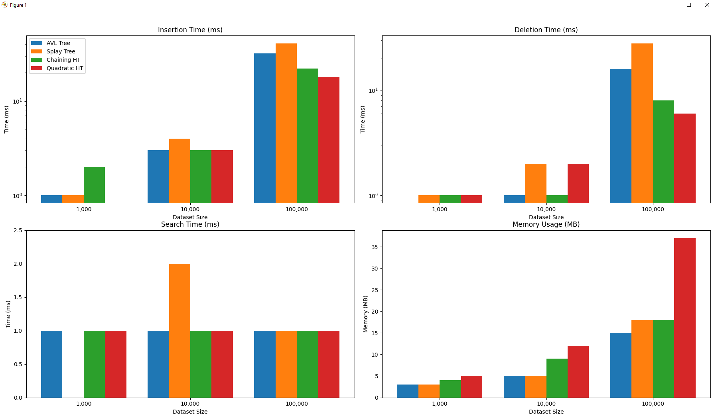

# Assignment 2 Report
Name: `Jonathan Rodriguez`
NetID: `jdr220004`
Section: `501`

## Project Setup
- **Test Environment**: Java 8, **CPU**: Ryzen 5 7600X, **MEMORY**: 32GB 5600Mhz
- **Test Data**: Random integers from 0 - 1_000_000
- **Operations**: Insert, Delete, Search
- **Test Sizes**: 1_000, 10_000, 100_000

## Performance Results

The results shown are the averages of 10 runs

### Insertion (ms)

| Structure | 1_000 | 10_000 | 100_000 |
|-----------|-------|--------|----------|
|AVL Tree | 1 | 3 | 32|
|Splay Tree | 1 | 4 | 41|
|Chaining Hash Table | 2 | 3 | 21|
|Quadratic Probing Hash Table | 0 | 2 | 7|

### Deletion (ms)

| Structure | 1_000 | 10_000 | 100_000 |
|-----------|-------|--------|----------|
|AVL Tree | 0 | 1 | 16|
|Splay Tree | 1 | 2 | 28|
|Chaining Hash Table | 1 | 1 | 8|
|Quadratic Probing Hash Table | 1 | 1 | 3|

### Search (ms)

| Structure | 1_000 | 10_000 | 100_000 |
|-----------|-------|--------|----------|
|AVL Tree | 1 | 1 | 1|
|Splay Tree | 0 | 2 | 1|
|Chaining Hash Table | 1 | 1 | 1|
|Quadratic Probing Hash Table | 1 | 0 | 0|

### Memory Usage (MB)

| Structure | 1_000 | 10_000 | 100_000 |
|-----------|-------|--------|----------|
|AVL Tree | 3 | 5 | 15|
|Splay Tree | 3 | 5| 18|
|Chaining Hash Table | 4 | 8 | 22|
|Quadratic Probing Hash Table | 4 | 9 | 30|

## Observations

### Insertion

- Overall, both Hash Tables outperform both the AVL Tree and Splay Tree with the Probing being the fastest at just 3ms of insertion time
- I would assume that due to the strict balancing rules of the AVL Tree, it outperforms the Splay Tree

### Deletion

- Quadratic Probing is by far the best at deletion, followed up by Chaining
- Both trees are the slowest as they have to rebalance themselves for every single deletion

### Search

- Nearly all structures have almost instant search times with Quadratic Probing being the fastest of them all

### Memory Usage

- At all levels, the 2 trees use less memory than the hash tables since they do not reserve any more memory than they need to
- Quadratic Probing uses slightly more memory than Chaining, around 8MB at the larger data sets

## Graphs

